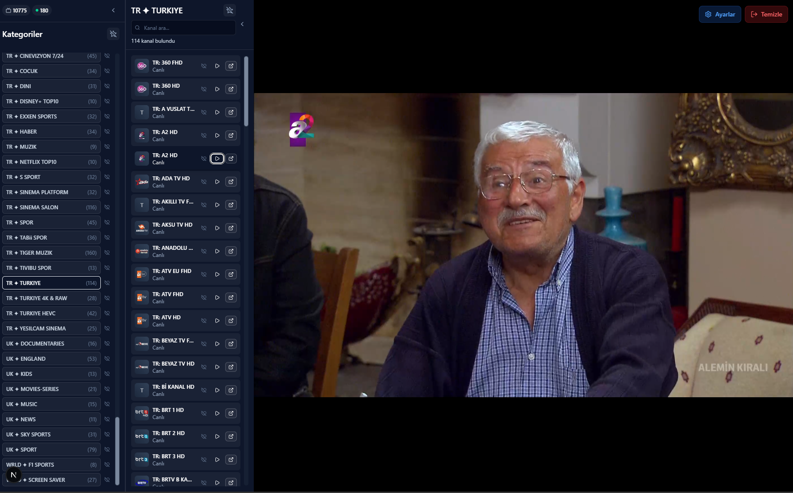

# REACT IPTV CLIENT

Modern IPTV streaming application built with Next.js and Xtream Codes API integration.

> A sleek, responsive IPTV player with PWA support, real-time streaming, and smart caching for seamless viewing experience.

## Screenshot



*Modern dark-themed interface with category browsing, channel list, and live video player*

## Features

- Modern dark theme with glass morphism effects
- Responsive design for desktop, tablet and mobile
- PWA support - installable on mobile devices
- HLS.js for smooth video playback
- Category-based channel browsing
- Real-time search functionality
- Favorites system for channels and categories
- Web-based IPTV configuration
- Built-in proxy system
- 5-minute cache for faster loading

## Installation

1. **Install dependencies**
   ```bash
   npm install
   ```

2. **Start development server**
   ```bash
   npm run dev
   ```

3. **Open in browser**
   Navigate to `http://localhost:3000`

4. **Configure IPTV credentials**
   - IPTV configuration form will appear when app opens
   - Enter your API Base URL, username and password
   - Credentials are stored securely in your browser

## Commands

- `npm run dev` - Development server
- `npm run build` - Production build
- `npm run start` - Production server
- `npm run lint` - ESLint check

## PWA Features

- Installable as native app on mobile devices
- Fast loading with offline cache
- Fullscreen mode
- Service Worker for static file caching

## Project Structure

```
src/
├── app/                    # Next.js App Router
│   ├── api/               # API routes
│   ├── layout.tsx         # Root layout
│   └── page.tsx           # Home page
├── components/            # React components
│   ├── AuthWrapper.tsx    # Authentication wrapper
│   ├── ChannelBrowser.tsx # Main channel browser
│   ├── LoginForm.tsx      # IPTV configuration form
│   └── VideoPlayer.tsx    # Video player
├── contexts/              # React contexts
├── hooks/                 # Custom hooks
├── lib/                   # Utility libraries
└── types/                 # TypeScript definitions
```

## Docker Deployment

```bash
docker-compose up -d
```

Application will run at `http://localhost:3444`.

## Production Build

```bash
npm run build
npm run start
```

## Troubleshooting

- **Stream not loading**: Check your IPTV credentials
- **CORS errors**: Check proxy settings
- **PWA not installing**: Make sure you're using HTTPS

---

**Note**: This application is designed for personal use with legitimate IPTV services.

---

## Tags

`iptv` `streaming` `nextjs` `react` `typescript` `pwa` `hls` `xtream-codes` `video-player` `responsive` `dark-theme` `tailwindcss` `docker` `modern-ui`